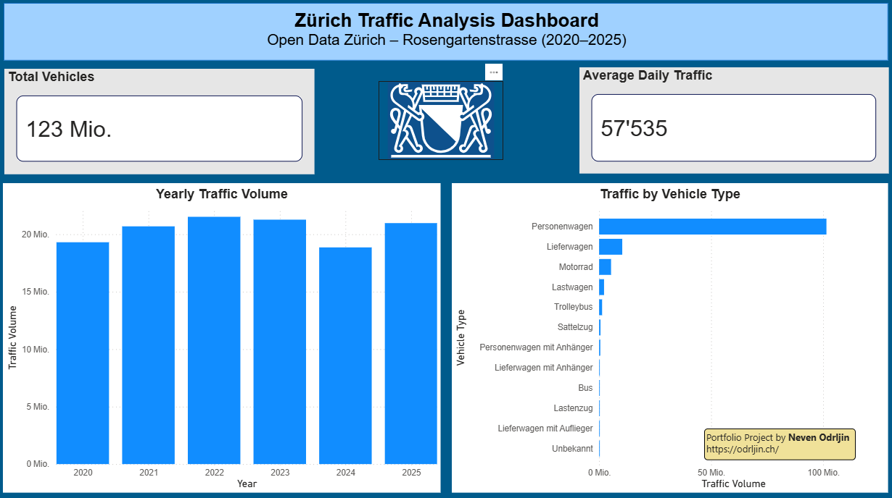
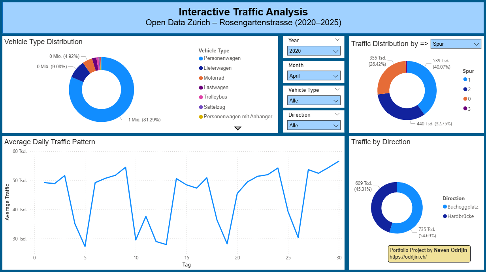

# Zurich Open Data Traffic Analysis

## Kurzbeschreibung
Kompaktes Datenanalyse-Projekt mit vollständigem Workflow:
Open-Data-Daten importieren, mit Python zusammenführen, im Jupyter Notebook analysieren und in Power BI als interaktives Dashboard visualisieren.

## Ziel
Aus mehreren Jahres-CSV-Dateien entsteht eine bereinigte Gesamttabelle (`traffic_data_combined.csv`).
Diese Datei ist die Basis für das Power-BI-Dashboard (`.pbix`).

## Datenquelle
Open Data Zürich – Verkehrsdaten Stundenwerte Rosengartenbrücke:
https://data.stadt-zuerich.ch/dataset/ugz_verkehrsdaten_stundenwerte_rosengartenbruecke
(Abruf: 14.05.2026)

## Projektstruktur

```text
rosengarten-traffic-analysis/
|
|-- data/
|   |-- raw/
|   |-- processed/
|
|-- scripts/
|   |-- merge_traffic_data.py
|
|-- notebooks/
|   |-- traffic_analysis.ipynb
|
|-- powerbi/
|   |-- zurich_traffic_dashboard.pbix
|
|-- img/
|   |-- Executive-Overview.png
|   |-- Interactive-Analysis.png
|
|-- README.md
|-- requirements.txt
|-- .gitignore
|-- LICENSE
|-- CHANGELOG.md
```

## Workflow
1. Rohdaten als CSV in `data/raw/` ablegen.
2. Python-Skript ausführen.
3. Kombinierte Datei in `data/processed/traffic_data_combined.csv` entsteht.
4. Datei in Power BI laden und Dashboard bauen.

## Technologien
- Python
- Pandas
- Power BI
- GitHub

## Python-Skript: `scripts/merge_traffic_data.py`
Das Skript:
- liest alle CSV-Dateien aus `data/raw/` ein
- ergänzt bei Bedarf die Spalte `year` aus dem Dateinamen
- prüft, ob die Spaltenstruktur zwischen den Dateien passt
- führt alle Dateien in eine Tabelle zusammen
- speichert das Ergebnis als `data/processed/traffic_data_combined.csv`

### Ausführung

```bash
python -m venv .venv
.venv\Scripts\Activate.ps1
pip install -r requirements.txt
python scripts/merge_traffic_data.py
```

## Power-BI-Dashboard
Die Datei `powerbi/zurich_traffic_dashboard.pbix` ist das Dashboard auf Basis der kombinierten CSV.

### Seite 1: Executive Overview
Management-orientierte Übersichtsseite mit den wichtigsten Verkehrs-KPIs und Trends.

Inhalt:
- KPI: Total Vehicles
- KPI: Average Daily Traffic
- Diagramm: Yearly Traffic Volume
- Diagramm: Traffic by Vehicle Type

Ziel:
Schneller Überblick über die Verkehrsdaten und die wichtigsten Entwicklungen zwischen 2020 und 2025.



### Seite 2: Interactive Traffic Analysis
Interaktive Seite zur detaillierten Untersuchung der Verkehrsdaten.

Inhalt:
- Vehicle Type Distribution
- Traffic Distribution by Lane
- Traffic by Direction
- Daily Traffic Pattern
- Interaktive Slicer und Parameter-Auswahl

Ziel:
Demonstration von Power-BI-Funktionen wie Filterung, Parametersteuerung und explorativer Analyse.



## Hinweise
Das Projekt zeigt, wie man öffentliche Datenquellen nutzt, Rohdaten strukturiert und mit Python für Power BI aufbereitet.

## Erweiterungen (Ideen)
- Weitere Jahre aufnehmen
- Zusätzliche KPIs (z. B. Peak-Stunden, Wochentagsmuster)
- Kombination mit Einwohnerdaten
- Kombination mit Parkplatzdaten
- Regionale Vergleiche innerhalb Zürich

## Strukturhinweis
Die Struktur ist für ein Portfolio-Projekt geeignet.
Optional:
- `data/raw/.gitkeep` und `data/processed/.gitkeep` für leere Ordner
- `tests/` für einfache Checks
- `docs/` für Screenshots
